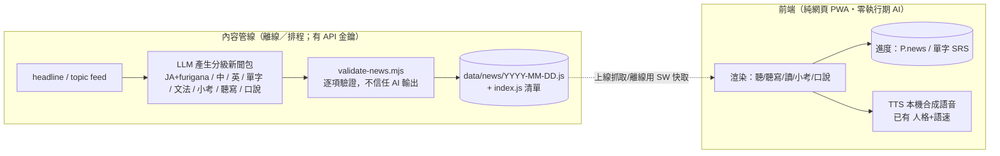

# AI 新聞聽寫／口說模組 — 設計文件

> 狀態：**設計定稿（本輪不實作）**。目標是把「每日 AI 新聞」的聽力／聽寫／閱讀／小考／口說整合進現有
> 五十音練習器，且**不破壞**其核心約束：純前端、離線可用、零建置、零執行期依賴、
> 「程式與題庫分離」（`data/levels.js` 是唯一資料來源，程式只負責渲染）。
>
> **已拍板決策（本次確認）**：
> 1. 內容＝**LLM 閱讀真實新聞後產出的「重製摘要」**（改寫／濃縮，**不使用原文逐字**）。見 §3、§9。
> 2. 口說評分＝**自評 ＋ 錄音回放**（MVP）；不做自動評分。見 §6。
> 3. 本輪只定設計，**尚不實作**（不需先設 API 金鑰或後端）。

---

## 0. 核心張力與解法（最重要）

「AI 新聞」直覺上需要執行期呼叫 LLM 產內容——但那會：暴露 API 金鑰於前端、每位使用者都花費用、
只能上線使用、破壞離線與零依賴。**這與本專案設計相衝突，不可接受。**

**解法：沿用既有的「Gemini 題庫分離」模式。** 就像 `data/levels.js` 是 Gemini **離線**產出、
程式只渲染；每日新聞也是由一條**離線／建置期的 AI 內容管線**產生成一個**靜態新聞包**（JSON/JS 資料檔），
提交進 repo 或以靜態檔提供。**前端仍是純網頁**——只是多渲染一種資料包（上線時抓取、離線時用快取）。

> 一句話：**AI 在管線裡，不在瀏覽器裡。** 前端永遠零執行期 AI 依賴。

這一點決定了整個模組的架構，其餘設計都建立其上。



---

## 1. 功能範圍（依使用者需求）

- 每日 AI 新聞（分 JLPT 難度）
- **中日英摘要對照**（逐段平行文本）
- **單字翻譯對照**（詞彙表 + 點詞看解釋）
- **文法重點**
- **小考 5 題**（多題型）
- **聽寫**（聽句子 → 打字還原）
- **口說練習**：可複用內容、不同**語速**、不同**難度**

拆成三種技能：**聽（聽力/聽寫）**、**讀（摘要/單字/文法）**、**說（跟讀/朗讀）**。

---

## 2. 資料結構：新聞包（延續題庫分離）

每日一包，例如 `data/news/2026-07-21.js`，掛在全域變數（與 `window.KANA_DATA` 同哲學）：

```js
window.KANA_NEWS = {
  date: "2026-07-21",
  level: "N5",                       // 該包目標 JLPT；亦可同主題多難度變體
  source: { title, publisher, url, license, note },  // 出處/授權；見 §9
  title: { ja, furigana, zh, en },
  summary: [                          // 逐段平行文本
    { ja, furigana, zh, en }
  ],
  vocab: [
    { word:"政府", reading:"せいふ", zh:"政府", en:"government", pos:"名詞", jlpt:"N4",
      example:{ ja, zh } }
  ],
  grammar: [
    { point:"〜について", zh:"關於～", en:"about", example:{ ja, zh }, note }
  ],
  quiz: [                             // 恰 5 題
    { type:"listening|reading|vocab|grammar|cloze",
      prompt:{ ja, zh }, audioText?:"要朗讀的句子", options:[…], answer:0, explain:{ zh } }
  ],
  dictation: [                        // 聽寫句
    { ja:"きょうのニュースです。", furigana, accept:["…"], hint }
  ],
  speaking: [                         // 口說/跟讀行；語速由前端控制（七步跟讀，§6）
    { ja, furigana, zh, focus:"intonation|pacing",
      linking?:"連音/弱化/省音提示（供第 2 步標記；可省）" }
  ]
};
```

**注意：不需要音檔。** 朗讀一律用**本機 Web Speech 合成**（已有人格＋語速），所以新聞包純文字、體積小、
離線可完整發聲——這是相對「錄音包」的一大優勢。

清單檔 `data/news/index.js` → `window.KANA_NEWS_INDEX = { days:["2026-07-21", …], latest:"…" }`，
供前端知道有哪些包、抓最新。

---

## 3. 內容管線（每日新聞怎麼來）— 主要決策點

| 方案 | 說明 | 取捨 |
|---|---|---|
| **A. 排程離線管線（建議）** | GitHub Action（每日 cron）跑 Node 腳本：**抓取真實新聞來源（RSS/API 的標題＋內文）→ 交 LLM 產出「重製摘要」**（改寫濃縮成分級日文＋中英對照，非逐字複製）→ 跑 `validate-news.mjs` → 通過才 commit `data/news/*`。前端上線抓取、SW 快取離線用。 | 前端維持純網頁/離線；AI 每日 1 次呼叫、成本極低；金鑰不進前端。需使用者設定 Action 與 API secret。 |
| **C. 輕量無伺服器代理** | Cloudflare Worker / Supabase Edge Function 代呼叫 LLM 並快取每日結果；前端向它抓。 | 可支援**隨選**主題/難度；金鑰不在前端。但需部署後端 + secret，且新內容需上線。作為 A 的升級路。 |
| **B. 前端執行期直呼 LLM** | ❌ 金鑰外洩、每人花費、僅上線。**否決**（破壞設計）。 | — |

**建議：MVP 用 A**（最貼近本專案精神、最省、離線優先），日後要「隨選生成」再上 C。

---

## 4. 難度模型（JLPT）

- 每包標 `level`（N5–N1）；管線可對**同一主題**產多難度變體（共用單字/文法鷹架）。
- 難度影響：句長、漢字密度（→ **振假名開關**）、單字罕見度、TTS 預設語速。
- 前端：使用者選程度 → 顯示對應變體；振假名可切換；生詞可點 → 解釋彈窗。

---

## 5. 各技能流程（**大量重用現有元件**）

好消息：口說的「語速/音色」在**語音設定**已解決；跟讀在 `shadowScreen` 已有；輸入題型在考試已有；
翻牌揭曉模式可直接借用。所以本模組主要是**編排既有積木 + 新資料包**。

**技能順序刻意採「輸入先於輸出」：聽 → 聽寫 → 讀（含小考）→ 口說**（介面依此排列並提示先完成輸入；
產出型步驟受 §5.1 閘控）。

- **📻 聽力**：TTS 逐句播放（可重播、用既有語速控制）；平行文本預設隱藏，逐句揭曉（借翻牌揭曉法）。
- **✍️ 聽寫**：播一句 → 使用者打字 → 比對（寬鬆：略標點、假名/漢字可互通、`accept[]` 容錯）→ 顯示差異。借用考試的輸入題型與 `romajiEq` 思路（改為假名比對）。
- **📖 閱讀**：JA/中/英 平行切換、振假名切換、點詞看 gloss、文法重點列表。
- **📝 小考 5 題**：借 `examScreen` 流程（題數模式已支援 `qTotal`）；題型 listening/reading/vocab/grammar/cloze；及格門檻如 3/5。可選：把新聞單字餵入**獨立單字 SRS deck**（沿用 FSRS-lite）。
- **🗣️ 口說（分階七步跟讀）**：不是單一「聽→哼→影子」，而是**七步序列**（見 §6）；**語速**＝既有 rate、**音色**＝人格；產出（脫稿）受 §5.1 閘控。

### 5.1 輸入先於輸出（產出解鎖閘控）

初階即自由開口，容易以母語規則硬拼、形成錯誤迴路（語言石化）。故本模組**閘控產出**：

- **解鎖門檻**：口說的**第 7 步「脫稿演繹」與任何自由朗讀/複述**，需先達「該則輸入熟練」——
  當日**聽力聽過 + 聽寫完成 + 小考 ≥ 及格**；未達門檻時，口說**只開放第 1–6 步（模仿/跟讀）**。
- **依難度縮放輸入/輸出比重**：
  - **N5（音韻啟航）**：口說僅跟讀模仿（第 1–6 步），**不開**自由產出——維持高輸入比。
  - **N3（中級）**：解鎖語意融合＋**有限**脫稿複述。
  - **N1（高級）**：解鎖自由脫稿／意見輸出（被推動的輸出）。
- 狀態記錄：`P.news.inputDone[date] = { listen, dictation, quizPassed }`，供閘控判斷（§8）。

---

## 6. 口說：分階七步跟讀（含自評＋錄音回放）

口說改以**七步序列**進行，對應新聞包 `speaking[]` / `summary[]` ＋既有 TTS（語速/人格）＋`MediaRecorder`：

1. **音韻浸潤**：TTS 整段/逐句播 2–3 次，文本隱藏，只感受語調與節奏。
2. **語音標記**：顯示文本＋振假名，標出連音／弱化／省音節點（資料含 `linking` 提示則用之，缺則以振假名＋備註替代）。
3. **視讀哼唱**：看文本小聲哼跟。
4. **盲聽節奏**：移除文本，僅憑聽覺影子跟讀（重節奏、不強求語意）。
5. **語意融合**：一邊跟讀一邊浮現中文對照／情境（借平行文本逐句揭曉）。
6. **錄音診斷（＝本模組的口說評分）**：`MediaRecorder` 錄自錄，與**原聲（本機 TTS）**對照，使用者自評語調／停頓／弱讀。純前端、離線、錄音**留本機不外傳**。
7. **脫稿演繹**：關原聲，憑記憶複述——**受 §5.1 閘控**（N5 不開；達輸入門檻或 N3+ 才解鎖）。

- **不做自動評分**。以下列**後續**（非本設計範圍）：
  - Web Speech Recognition（STT）轉文字比對 → 粗略正確率（主要 Chrome、需上線、日語辨識不穩）。
  - 真發音評分（Azure Pronunciation Assessment 之類，音素級）→ 需後端 + 金鑰 + 成本。

---

## 7. 離線與快取

- SW 快取：新聞清單 + 最近 N 天包（純文字，小）。**音訊為本機 TTS 合成，不需音檔**，故快取到的日子可完整聽/說。
- 無網路且無快取 → 顯示最近一則並標「離線：顯示最近內容」。

---

## 8. 與現有 App 的整合

- 首頁新增 **📰 每日新聞** 入口（有可用包時才有意義）。
- **重用**：`TTS`（人格/語速）、`examScreen`（小考，題數模式）、`shadowScreen`（口說）、輸入題型（聽寫）、翻牌揭曉（聽力）、`store`（進度）、FSRS-lite（新聞單字 deck，選配）。
- **新增狀態**：`P.news = { level:"N5", furigana:true, doneDays:{}, quizBest:{}, inputDone:{ /* date → { listen, dictation, quizPassed } */ } }`（`inputDone` 供口說產出閘控，§5.1），選配 `P.newsVocab`（單字 SRS）。
- **資料分離不變**：`data/news/*` 是唯一內容來源，程式只渲染；換來源＝換資料包。

---

## 9. 授權與安全（已定：真新聞 → LLM 重製摘要，不用原文）

採用「讀真實新聞 → LLM 產出**重製摘要**」。要守的界線：

- **只取事實、不取表達**：新聞「事實」不受著作權保護，可自由報導；受保護的是**原文的用字與結構**。
  因此 LLM 必須做**抽象式改寫／濃縮（abstractive summary）**，**不得逐字或近乎逐字**搬原文，
  不長段落照抄，改以自己的分級日文重述要點。
- **附出處**：每包 `source`（標題／媒體／連結／擷取時間），介面顯示「摘要改寫自 ○○ 報導」與原文連結（尊重來源、導流）。
- **提示詞紀律**（比照題庫「不信任輸出、先驗證」）：明寫「只重述事實要點、以 N□ 難度自撰句子、
  勿逐字複製、勿捏造未發生之事或真人不實引言、標註出處」。
- 無 PII；內容定位為「語言學習用之新聞摘要」。
- 保守做法：優先選**允許重用的來源**（多家媒體 RSS 提供標題＋短摘要；政府/公部門新聞稿多為公有領域），
  對商業媒體則僅取事實、限制摘要長度，降低風險。**法遵細節建議上線前再確認來源條款。**

---

## 10. 驗證腳本 `scripts/validate-news.mjs`（比照 `validate.mjs`）

欄位齊全且 JA/中/英皆非空；`quiz` 恰 5 題且 `answer` 索引合法；`vocab.reading` 全假名；
`level ∈ {N5…N1}`；`dictation.accept` 非空；振假名對齊；輸出 PASS/FAIL。**不通過不 commit。**

---

## 11. 分期（MVP → 完整）

- **MVP（純網頁，一則手造包）**：手動產一個 `data/news/*.js` 範例包，做「讀＋聽＋聽寫＋5題小考＋口說(跟讀)」UI，全部重用既有元件。**先驗證 UX、完全離線**，不含自動化。
- **Phase 2（自動化）**：GitHub Action + Gemini/Claude 管線 + `validate-news` + 清單 + SW 快取 → 真正「每日」。
- **Phase 3（強化）**：多難度變體、新聞單字 SRS deck、MediaRecorder 回放、選配 STT 粗評分。
- **Phase 4（後端，選配）**：無伺服器代理支援隨選主題/難度；Azure 發音評分。

---

## 12. 決策狀態

| # | 決策 | 結論 |
|---|---|---|
| 1 | 內容來源 | ✅ **真新聞 → LLM 重製摘要**（不用原文逐字）；附出處。 |
| 2 | 口說評分 | ✅ **自評 ＋ 錄音回放**（MediaRecorder，本機）；STT／發音評分列後續。 |
| 3 | 本輪動作 | ✅ MVP＋管線**已實作**：五技能 UI、內建範例包、`scripts/generate-news.mjs`＋`.github/workflows/daily-news.yml`（Gemini 每日累積）、`scripts/generate-wordbank.mjs`＋辭庫 ×5。 |
| 3.1 | 學習步驟對齊理論 | ✅ 口說採**分階七步跟讀**（§6）；**輸入先於輸出**閘控＋依難度縮放輸入/輸出比（§5.1）；不另加理論引用章節（步驟本身即對齊）。 |
| 4 | 內容管線 A/C | ✅ 採 **A**：每日 GitHub Action 離線管線，累積進 `data/news.js`（保留最近 60 則）。 |
| 5 | 管線用哪個 AI | ✅ **Gemini**（`GEMINI_API_KEY` secret、`GEMINI_MODEL` 預設 gemini-2.5-flash）。 |
| 6 | MVP 範圍 | ✅ 已交付；真實每日內容由使用者金鑰在 Action 產出（本環境不呼叫 Gemini）。 |

> 待實作啟動時的建議路線：**先做 MVP**（手造一則範例包 + 讀/聽/聽寫/小考/口說 UI，純離線、零風險）
> → 確認體驗 → 再接 Phase 2（GitHub Action + LLM 重製摘要管線 + `validate-news`）。
> 這樣先看得到、玩得到，且不必立刻設定 API 金鑰或後端。
